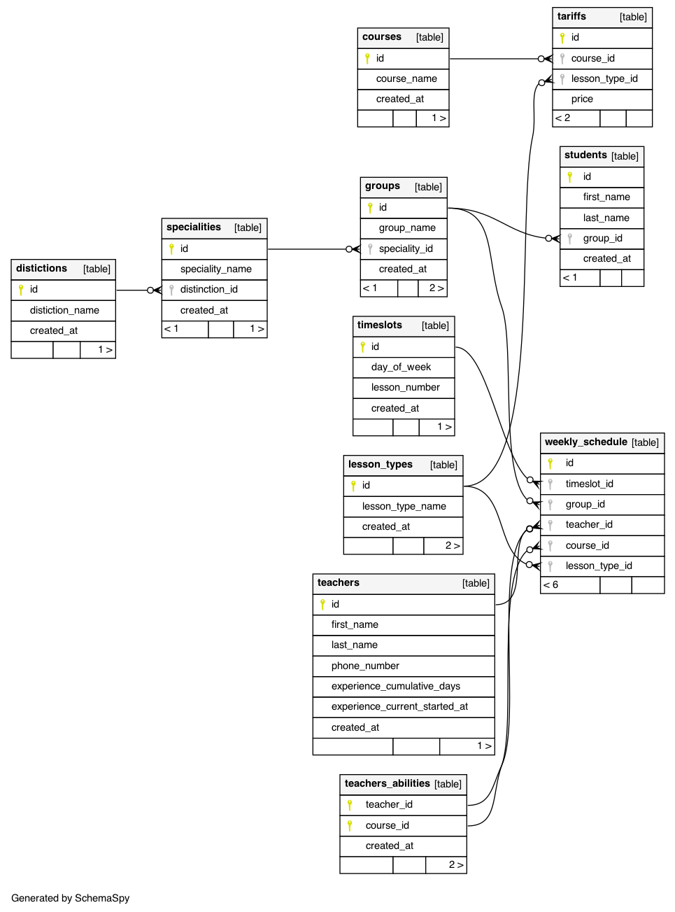

# Рогин

## 1. РАЗРАБОТКА ЛОГИЧЕСКОЙ МОДЕЛИ ПРЕДМЕТНОЙ ОБЛАСТИ

### Цель работы

Разработка базы данных для решение исходной проблемы

### Исходное описание предметной области

Вы работаете в учебном заведении и занимаетесь организацией курсов повышения
квалификации.
В вашем распоряжении имеются сведения о сформированных группах студентов. Группы
формируются в зависимости от специальности и отделения. В каждой из них включено
определенное количество студентов. Проведение занятий обеспечивает штат преподавателей. Для
каждого из них у вас в базе данных зарегистрированы стандартные анкетные данные (фамилия,
имя, отчество, телефон) и стаж работы. В результате распределения нагрузки вы получаете
информацию о том, сколько часов занятий проводит каждый преподаватель с соответствующими
группами. Кроме того, хранятся также сведения о виде проводимых занятий (лекции, практика),
предмете и оплате за 1 час.
В результате работы с базой данных выяснилось, что размер почасовой оплаты зависит от
предмета и типа занятия. Кроме того, каждый преподаватель может вести не все предметы, а
только некоторые.

### Cловесное описание выделенных сущностей, связей и атрибутов

```

- students
  - name
  - group_id

- groups
  - name
  - speciality_id

- specialities
  - name
  - distiction_id

- distictions
  - name

- teachers
  - first_name
  - last_name
  - phone_number
  - experience_cumulative
  - experience_current_started_at

- lesson_types : lecture or practice

- courses (предметы)
  - name

- teachers_abilities (unique concurrently)
  - teacher_id
  - course_id

- timeslots : weekly slots

- weekly_schedule
  - timeslot_id
  - group_id
  - teacher_id
  - course_id
  - lesson_type_id
    (check uniqueness: timeslot+group_id, timeslot+teacher_id)
    (check courseId+teacherId)
    foreign keys:
      - timeslot_id
      - group_id
      - teacher_id, course_id


- tariffs
  - course_id
  - lesson_type_id
  - price

```

### UML диаграмма

```
wget https://github.com/schemaspy/schemaspy/releases/download/v6.1.0/schemaspy-6.1.0.jar
#wget https://jdbc.postgresql.org/download/postgresql-9.4.1208.jre6.jar
curl https://jdbc.postgresql.org/download/postgresql-42.2.14.jar > postgresql.jar
# brew reinstall graphviz --with librsvg-pango
java -jar schemaspy-6.1.0.jar -t pgsql -dp ./postgresql.jar \
   -db postgres -host localhost -port 5432 -s rogin -u vasilii -p 123123 -o out

cp out/diagrams/summary/relationships.real.large.png relationships.real.large.png
```



### Вывод

Текстовый формат описания удобней для проектирования и разработки

## 2. РАЗРАБОТКА ФИЗИЧЕСКОЙ МОДЕЛИ ДАННЫХ И РЕАЛИЗАЦИЯ БАЗЫ ДАННЫХ

### Цель работы

Создать sql файл с базой

### Sql код таблиц

- [Инициализация](init.pgsql)
- [Создание таблиц](schema.pgsql)
- [Данные для таблиц](data.pgsql)

```bash
docker run -d --name psql -p 5432:5432 postgres:9.6
cat init.pgsql | docker exec -i psql psql -U postgres
cat schema.pgsql data.pgsql | docker exec -i psql psql -U postgres rogin
```

## 3. ФОРМИРОВАНИЕ SQL-ЗАПРОСОВ

```bash
cat queries.pgsql | docker exec -i psql psql -U postgres rogin
```

## 4. ДОБАВЛЕНИЕ ТРИГГЕРОВ В БАЗУ ДАННЫХ

## 5. СОЗДАНИЕ ПРЕДСТАВЛЕНИЙ В БАЗЕ ДАННЫХ
